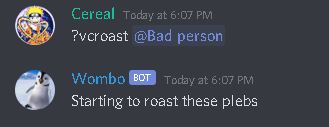

# Wombo-Bot

## What it does
A discord bot that does some little things. It can roast, and compliment people in a variety of forms. Aswell as some other stuff.

## Bot Invite Links
- [top.gg](https://top.gg/bot/707001510231277669)
- [Discord Bot List](https://discordbotlist.com/bots/wombo)

## Wombo's official server link
- [Wombo's Wallet](https://discord.gg/VZp2tFD)

## Installation
If you want to setup Wombo-Bot for youself here it is
1. Clone the repo
2. Run the command 'npm install'

## Setup
1. Go to [here](https://discord.com/developers/applications) and click new application and give the app a name
2. Then you can add a bot to that app, and copy its token
3. Create a file called '.env' in the project root
4. In the .env file set a variable called 'TOKEN' equals to your bots secret token EX: TOKEN="paste_your_token_here"
5. In your bots page in the developer portal you can find your bots invite link

## Coming Soon
- Some staff commands so that no one abuses the power of Wombo bot
- Adding a music command, so the bot is not totally annoying
- Going to add an introductory message whenever it joins a server

## Developer's Note
This is my first discord bot, and one of my first nodejs projects, if you have any feedback for me, or some tips you can reach me at sjalapati42@gmail.com
I also plan on adding loads more commands in the future

